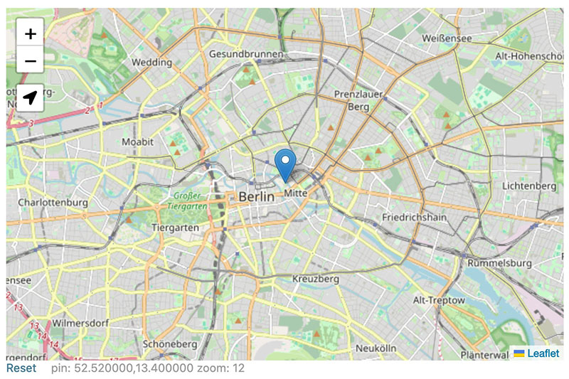

# Django: Map-Location

Adds a fully-static location field (Leaflet) to manage location-based data without the need for a full-fledged GeoDjango installation. ... when all you need is a visual position chooser.




## Install

1. Add to your INSTALLED_APPS

```py
INSTALLED_APPS = [
    ...,
    'map_location',
]
```

2. Create Map-Location field

```py
from map_location.fields import LocationField

class Place(models.Model):
    location = LocationField('Pos', blank=True, null=True, options={
        'map': {
            'center': [52.52, 13.40],
            'zoom': 12,
        },
        # 'markerZoom': 18
        # 'tileLayer': 'https://{s}.tile.openstreetmap.org/{z}/{x}/{y}.png',
        # 'tileOptions': {
        #     attribution: '© <a href="http://www.openstreetmap.org/copyright">OpenStreetMap</a>',
        # },
    })
```


## Options Paramter

| Key         | Info
|-------------|------------------
| map         | [Map Options](https://leafletjs.com/reference.html#map-option) (default: `{center: [20, -25], zoom: 2}`)
| markerZoom  | Initial zoom scale (on load) – if a marker is set.  (default: `18`)
| tileLayer   | [TileLayer](https://leafletjs.com/reference.html#tilelayer) urlTemplate (default: `"https://{s}.tile.openstreetmap.org/{z}/{x}/{y}.png"`)
| tileOptions | [TileLayer Options](https://leafletjs.com/reference.html#tilelayer-option) (default: `{}`)


## Usage

You can access the location by its parts (`place.location.lat` & `place.location.long`) or by its string value (`str(place.location)` or just `place.location`) which will return a comma-separated string (`lat,long`). This string format is also used for database storage (with a precision of 6 digits, or up to 11 cm).


## Example

If you export your location as json, you can use a fully static map:

```py
_JSON_ = {'loc': [place.location.lat, place.location.long]}
```

```html
<script src="/static/leaflet/leaflet.js"></script>
<script src="/static/leaflet/locate/L.Control.Locate.min.js"></script>
<link rel="stylesheet" href="/static/leaflet/leaflet.css" />
<link rel="stylesheet" href="/static/leaflet/locate/L.Control.Locate.css" />
...
<div id="map-id"></div>
...
<script>
    const osm = L.tileLayer('https://{s}.tile.openstreetmap.org/{z}/{x}/{y}.png');
    const map = L.map('map-id', {
        layers: [osm],
        center: [52.52, 13.40],
        zoom: 14,
    });
    L.control.locate({
        returnToPrevBounds: true,
        showPopup: false,
    }).addTo(map);
    L.marker(L.latLng(_JSON_.loc)).addTo(map);
    ...
</script>
```

See [Leaflet](https://leafletjs.com/) docs for configuration options.


## License

This project is licensed under MIT and includes:

- v1.9.4 [Leaflet](https://github.com/Leaflet/Leaflet) (BSD 2-Clause License)
- v0.81.1 [Leaflet.Locate](https://github.com/domoritz/leaflet-locatecontrol) (MIT)
